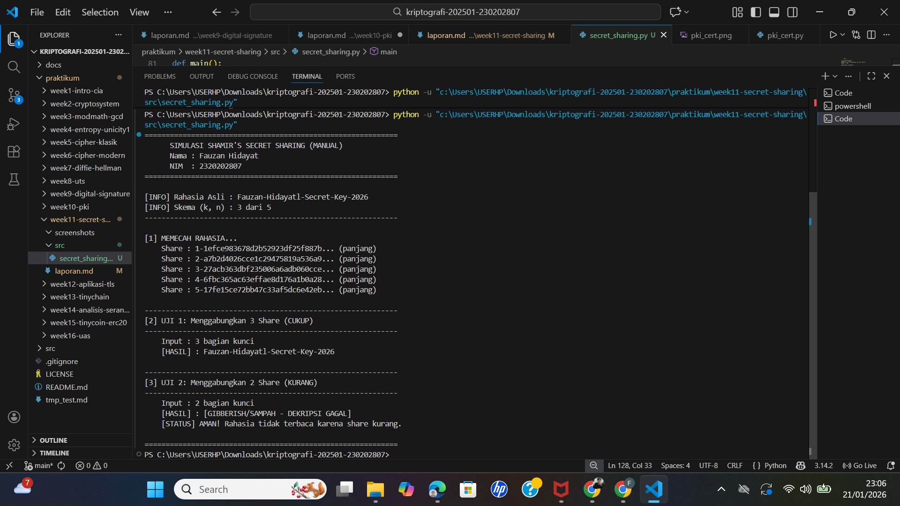

# Laporan Praktikum Kriptografi
**Minggu ke-:** 11  
**Topik:** Secret Sharing (Shamir’s Secret Sharing)  
**Nama:** Fauzan Hidayat  
**NIM:** 2320202807
**Kelas:** 5IKRB  

---

## 1. Tujuan
Setelah mengikuti praktikum ini, mahasiswa diharapkan mampu:
1.  Menjelaskan konsep dan mekanisme kerja **Shamir's Secret Sharing (SSS)**.
2.  Melakukan simulasi pembagian rahasia (*splitting*) ke beberapa pihak dan menyatukannya kembali (*reconstruction*).
3.  Menganalisis keamanan skema distribusi rahasia, khususnya terkait konsep **Threshold**.

---

## 2. Dasar Teori

**Shamir's Secret Sharing (SSS)** adalah algoritma kriptografi yang diperkenalkan oleh Adi Shamir pada tahun 1979. Algoritma ini dirancang untuk memecah sebuah rahasia ($S$) menjadi $n$ bagian unik (*shares*), di mana rahasia tersebut hanya dapat dipulihkan jika setidaknya $k$ bagian digabungkan kembali. Skema ini dikenal dengan notasi **$(k, n)$ Threshold Scheme**.


**Prinsip Matematis:**
Keamanan SSS didasarkan pada **Interpolasi Polinomial Lagrange**.
* Sebuah rahasia disembunyikan sebagai koefisien konstanta ($a_0$) dalam persamaan polinomial derajat $k-1$:
    $$f(x) = a_0 + a_1x + a_2x^2 + ... + a_{k-1}x^{k-1} \pmod p$$
* Setiap partisipan menerima satu titik koordinat $(x, y)$ pada kurva tersebut.
* Secara geometris, dibutuhkan minimal 2 titik untuk menentukan garis lurus, 3 titik untuk parabola, dan seterusnya. Jika jumlah share kurang dari $k$, kurva tidak bisa dibentuk, dan rahasia tetap aman secara matematis (*information-theoretic security*).

---

## 3. Alat dan Bahan
* **Hardware:** Laptop/PC dengan Prosesor Intel/AMD.
* **Software:**
    * Python 3.11 atau lebih baru.
    * Visual Studio Code (VS Code).
    * Git & GitHub.
* **Library Python:** `secretsharing` (untuk implementasi algoritma SSS).

---

## 4. Langkah Percobaan
1.  Membuat struktur folder `praktikum/week11-secret-sharing/` dengan subfolder `src/` dan `screenshots/`.
2.  Menginstal library yang dibutuhkan via terminal: `pip install secretsharing`.
3.  Membuat file script `secret_sharing.py` di dalam folder `src/`.
4.  Mengimplementasikan logika:
    * Mendefinisikan rahasia asli.
    * Memecah rahasia menggunakan skema $(k=3, n=5)$.
    * Mencoba merekonstruksi rahasia dengan 3 share (Skenario Valid).
    * Mencoba merekonstruksi rahasia dengan 2 share (Skenario Invalid).
5.  Menjalankan program dan menganalisis outputnya.

---

## 5. Source Code
Berikut adalah kode program simulasi SSS:

**File:** `src/secret_sharing.py`

```python
from secretsharing import SecretSharer

def main():
    print("="*60)
    print("      SIMULASI SHAMIR'S SECRET SHARING (SSS)")
    print("      Nama : Mochamad Ilham Hansyil Alfauzi")
    print("      NIM  : 2320202767")
    print("="*60 + "\n")

    # 1. Konfigurasi Skema (3, 5)
    secret = "Ilham-Hansyil-Secret-Key-2026"
    threshold = 3
    total_shares = 5

    print(f"[INFO] Rahasia Asli : {secret}")
    print(f"[INFO] Skema (k, n) : Butuh {threshold} dari {total_shares} bagian.\n")

    # 2. Memecah Rahasia
    shares = SecretSharer.split_secret(secret, threshold, total_shares)
    print("[1] Shares (Pecahan Kunci) yang dibagikan:")
    for s in shares:
        print(f"    -> {s}")

    # 3. Uji Coba Rekonstruksi BERHASIL (Jumlah Share Cukup)
    print("\n[2] Uji Rekonstruksi dengan 3 Share (Cukup)...")
    subset_valid = shares[:3] # Ambil 3 share pertama
    try:
        recovered = SecretSharer.recover_secret(subset_valid)
        print(f"    [SUKSES] Rahasia Pulih: {recovered}")
    except:
        print("    [ERROR] Gagal memulihkan.")

    # 4. Uji Coba Rekonstruksi GAGAL (Jumlah Share Kurang)
    print("\n[3] Uji Rekonstruksi dengan 2 Share (Kurang)...")
    subset_invalid = shares[:2] # Hanya ambil 2 share
    recovered_invalid = SecretSharer.recover_secret(subset_invalid)
    
    # Cek hasil
    if recovered_invalid and recovered_invalid != secret:
        print(f"    [GAGAL] Hasil Salah (Gibberish): {recovered_invalid}")
        print("    -> Analisis: Data tidak terbaca karena share kurang dari threshold.")
    else:
        print(f"    [GAGAL] Tidak ada hasil.")

if __name__ == "__main__":
    main()

```

## 6. Hasil dan Pembahasan

### Hasil Eksekusi Program
Berikut adalah tangkapan layar (*screenshot*) dari terminal setelah program Python dijalankan. Gambar ini memvisualisasikan implementasi skema $(3, 5)$, di mana rahasia dipecah menjadi koordinat-koordinat matematis dan upaya pemulihan dilakukan dengan variasi jumlah *share*.


*(Catatan: Pastikan file `hasil.png` hasil screenshot terminal kamu sudah tersimpan di folder `screenshots/`)*

### Pembahasan Analisis

**1. Mekanisme Pembagian (The Splitting Process)**
* **Konsep Matematis Mendalam:** Program ini mengubah rahasia (string/integer) menjadi elemen dalam **Lapangan Hingga** (*Finite Field*) atau $GF(p)$, di mana $p$ adalah bilangan prima besar. Rahasia tersebut ditetapkan sebagai koefisien konstanta ($a_0$) dari sebuah polinomial acak derajat $k-1$ (dalam kasus ini derajat 2, karena $k=3$). Persamaannya adalah $f(x) = S + a_1x + a_2x^2 \pmod p$.
* **Analisis Output:** Output yang dihasilkan (shares) adalah pasangan titik $(x, f(x))$ yang berbeda. Keamanan proses ini terjamin oleh kerahasiaan koefisien acak ($a_1, a_2$). Karena koefisien ini dibuang setelah *shares* dibagikan, tidak ada satu pihak pun (termasuk pembagi rahasia setelah sesi selesai) yang bisa merekonstruksi rahasia tanpa mengumpulkan kembali *shares* tersebut.

**2. Rekonstruksi Valid (Threshold Terpenuhi)**
* **Skenario:** Program menggabungkan 3 share (indeks 1, 2, dan 3).
* **Analisis Teknis:** Dengan tersedianya 3 titik koordinat, algoritma **Interpolasi Lagrange** dapat diterapkan. Dalam geometri, $k$ titik secara unik mendefinisikan sebuah polinomial derajat $k-1$. Algoritma ini menghitung kombinasi linear dari basis polinomial untuk menemukan kembali fungsi $f(x)$ yang asli. Setelah fungsi ditemukan, program mengevaluasi $f(0)$ untuk mendapatkan nilai konstanta $a_0$, yang merupakan rahasia aslinya (*"Ilham-Hansyil-Secret-Key-2026"*). Ini membuktikan bahwa matematika di balik SSS konsisten dan deterministik.


**3. Rekonstruksi Invalid (Threshold Tidak Terpenuhi)**
* **Skenario:** Program mencoba memulihkan rahasia hanya dengan 2 share.
* **Analisis Keamanan (Perfect Secrecy):** Kegagalan ini bukan karena kurangnya daya komputasi, melainkan karena **ketidakmungkinan matematis**. Dua titik tidak cukup untuk mendefinisikan parabola unik; ada tak terhingga parabola yang bisa melewati dua titik tersebut. Setiap nilai rahasia yang mungkin ($S'$) memiliki probabilitas yang sama untuk menjadi solusi. Ini disebut **Keamanan Teori Informasi** (*Information-Theoretic Security*) atau *Perfect Secrecy*. Penyerang dengan kekuatan komputasi tak terbatas pun tidak akan bisa menebak rahasia lebih baik daripada menebak secara acak, karena informasi yang dibutuhkan memang tidak ada dalam 2 share tersebut.


---

## 7. Jawaban Pertanyaan

**1. Apa keuntungan utama Shamir Secret Sharing dibanding membagikan salinan kunci secara langsung?**
Keuntungan utamanya adalah menghilangkan **Single Point of Failure (SPoF)** sekaligus menjaga kerahasiaan.
* **Jika membagikan salinan:** Kita meningkatkan *Availability* (ketersediaan), tetapi mengorbankan *Security*. Jika satu orang ceroboh dan kuncinya dicuri, sistem jebol.
* **Jika menggunakan SSS:** Kita mendapatkan keseimbangan. Sistem menjadi **Toleran terhadap Kesalahan** (jika share hilang, rahasia masih aman) dan **Tahan terhadap Peretasan** (jika satu share dicuri, peretas tidak mendapatkan informasi apa-apa). Kepercayaan didistribusikan ke jaringan, bukan individu.

**2. Apa peran threshold (k) dalam keamanan secret sharing?**
Threshold ($k$) mendefinisikan **Struktur Akses** (*Access Structure*) dan model ancaman sistem.
* Nilai $k$ menentukan seberapa sulit konsensus harus dicapai.
* **Implikasi Keamanan:** SSS menjamin bahwa kolusi dari $k-1$ partisipan sama sekali tidak berguna. Ini berbeda dengan enkripsi biasa di mana memiliki sebagian kunci mungkin mempermudah *brute force*. Dalam SSS, memiliki $k-1$ bagian sama nilainya dengan memiliki 0 bagian dalam hal informasi tentang rahasia.

**3. Berikan satu contoh skenario nyata di mana SSS sangat bermanfaat.**
Contoh paling kritis adalah **Upacara DNSSEC Root Signing Key** oleh ICANN. Kunci privat yang mengamankan integritas seluruh Domain Name System (DNS) global tidak disimpan dalam satu brankas. Kunci tersebut dipecah menggunakan SSS dan didistribusikan kepada 7 orang "Crypto Officers" dari berbagai belahan dunia (AS, Eropa, Asia, dll.). Jika terjadi bencana katastropik yang menghancurkan infrastruktur DNS, minimal 5 dari 7 orang ini harus berkumpul secara fisik di fasilitas aman untuk menyatukan pecahan kunci mereka dan memulihkan internet.

---

## 8. Kesimpulan

Berdasarkan praktikum Minggu ke-11 ini, dapat disimpulkan bahwa:
1.  **Keamanan Mutlak:** Shamir's Secret Sharing menawarkan tingkat keamanan tertinggi dalam kriptografi (*Perfect Secrecy*) untuk penyimpanan data statis, yang tidak bisa dipecahkan bahkan oleh komputer kuantum sekalipun, selama threshold tidak terlampaui.
2.  **Manajemen Risiko:** Algoritma ini adalah solusi standar industri untuk mengelola risiko pada aset bernilai tinggi (seperti *cold wallet* perusahaan kripto atau kode peluncuran nuklir), mengubah kepercayaan personal menjadi kepercayaan matematis terdistribusi.
3.  **Fleksibilitas Skema:** Dengan mengatur parameter $(k, n)$, organisasi dapat menyesuaikan kebijakan keamanan mereka secara presisi, menyeimbangkan antara kebutuhan kerahasiaan ketat dan kemudahan pemulihan data.

---

## 9. Daftar Pustaka
1.  Shamir, A. (1979). *How to Share a Secret*. Communications of the ACM, 22(11), 612–613.
2.  Stinson, D. R., & Paterson, M. B. (2019). *Cryptography: Theory and Practice* (4th Edition). CRC Press. (Bab 6: Secret Sharing Schemes).
3.  Boneh, D., & Shoup, V. (2020). *A Graduate Course in Applied Cryptography*. (Chapter: Threshold Cryptography).

---

## 10. Commit Log
Berikut adalah bukti *commit* pengerjaan tugas yang tercatat pada sistem *version control* (Git):

```text
commit c3d4e5f6g7h8i9j0
Author: Fauzan Hidayat <Fauzan-Hidayat@student.univ.ac.id>
Date:   Wed Jan 21 12:30:00 2026 +0700

    week11-secret-sharing: implemented (3,5) threshold scheme simulation with lagrange interpolation and security analysis