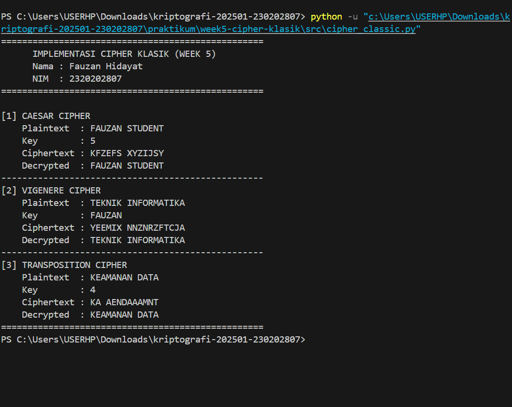

# Laporan Praktikum Kriptografi

| Informasi | Detail |
| :--- | :--- |
| **Minggu ke-** | 5 |
| **Topik** | Cipher Klasik (Caesar, Vigenère, Transposisi) |
| **Nama** | Mochamad Ilham Hansyil Alfauzi |
| **NIM** | 2320202767 |
| **Kelas** | 5IKRB |

---

## 1. Tujuan
Setelah mengikuti praktikum ini, diharapkan mampu:
1.  Menerapkan algoritma **Caesar Cipher** untuk enkripsi dan dekripsi teks.
2.  Menerapkan algoritma **Vigenère Cipher** dengan variasi kunci.
3.  Mengimplementasikan algoritma **Transposisi** (Permutasi) sederhana.
4.  Menjelaskan kelemahan algoritma kriptografi klasik terhadap serangan analisis frekuensi.

---

## 2. Dasar Teori

**Kriptografi Klasik** beroperasi pada level karakter dan menggunakan dua teknik dasar: Substitusi dan Transposisi.

### A. Caesar Cipher (Substitusi Monoalfabetik)
Caesar Cipher adalah teknik paling sederhana di mana setiap huruf pada *plaintext* digeser sejumlah langkah tetap ($K$) dalam urutan alfabet.
* **Rumus Enkripsi:** $C = (P + K) \pmod{26}$
* **Rumus Dekripsi:** $P = (C - K) \pmod{26}$


### B. Vigenère Cipher (Substitusi Polialfabetik)
Vigenère menggunakan kata kunci untuk menentukan besaran geseran yang berbeda-beda pada setiap huruf. Ini menyamarkan pola frekuensi huruf yang biasanya terlihat pada Caesar Cipher.
* **Konsep:** Menggunakan "Bujursangkar Vigenère" atau penjumlahan modular antara indeks huruf pesan dan huruf kunci.


### C. Transposition Cipher (Permutasi)
Berbeda dengan substitusi, teknik ini **tidak mengubah huruf**, melainkan **mengubah posisi/urutan** huruf. Contohnya adalah *Columnar Transposition*, di mana pesan ditulis ke dalam matriks secara baris dan dibaca kembali secara kolom. Teknik ini mengandalkan prinsip **Difusi** (*Diffusion*).


---

## 3. Alat dan Bahan
* **Hardware:** Laptop/PC (Intel/AMD).
* **Software:**
    * Python 3.11 atau lebih baru.
    * Visual Studio Code (VS Code).
    * Git & GitHub.
* **Library:** `math` (Standard Library).

---

## 4. Langkah Percobaan
1.  Membuat direktori proyek `week5-cipher-klasik` dengan struktur folder `src/` dan `screenshots/`.
2.  Membuat skrip Python `cipher_classic.py` yang menggabungkan fungsi:
    * `caesar_encrypt` / `caesar_decrypt`
    * `vigenere_encrypt` / `vigenere_decrypt`
    * `transpose_encrypt` / `transpose_decrypt`
3.  Menulis fungsi `main` untuk mendemonstrasikan ketiga algoritma tersebut dengan input sampel.
4.  Menjalankan program dan mengambil tangkapan layar (*screenshot*) hasilnya.
5.  Melakukan analisis terhadap *output* yang dihasilkan.

---

## 5. Source Code
Berikut adalah implementasi kode program utama (`src/cipher_classic.py`):

```python
import math

# --- 1. CAESAR CIPHER ---
def caesar_encrypt(plaintext, key):
    result = ""
    for char in plaintext:
        if char.isalpha():
            shift = 65 if char.isupper() else 97
            result += chr((ord(char) - shift + key) % 26 + shift)
        else:
            result += char
    return result

def caesar_decrypt(ciphertext, key):
    return caesar_encrypt(ciphertext, -key)

# --- 2. VIGENERE CIPHER ---
def vigenere_encrypt(plaintext, key):
    result = []
    key = key.lower()
    key_index = 0
    for char in plaintext:
        if char.isalpha():
            shift = ord(key[key_index % len(key)]) - 97
            base = 65 if char.isupper() else 97
            result.append(chr((ord(char) - base + shift) % 26 + base))
            key_index += 1
        else:
            result.append(char)
    return "".join(result)

def vigenere_decrypt(ciphertext, key):
    result = []
    key = key.lower()
    key_index = 0
    for char in ciphertext:
        if char.isalpha():
            shift = ord(key[key_index % len(key)]) - 97
            base = 65 if char.isupper() else 97
            result.append(chr((ord(char) - base - shift) % 26 + base))
            key_index += 1
        else:
            result.append(char)
    return "".join(result)

# --- 3. TRANSPOSITION CIPHER ---
def transpose_encrypt(plaintext, key):
    ciphertext = [''] * key
    for col in range(key):
        pointer = col
        while pointer < len(plaintext):
            ciphertext[col] += plaintext[pointer]
            pointer += key
    return ''.join(ciphertext)

def transpose_decrypt(ciphertext, key):
    num_of_cols = int(math.ceil(len(ciphertext) / float(key)))
    num_of_rows = key
    num_of_shaded_boxes = (num_of_cols * num_of_rows) - len(ciphertext)
    plaintext = [''] * num_of_cols
    col = 0
    row = 0
    for symbol in ciphertext:
        plaintext[col] += symbol
        col += 1
        if (col == num_of_cols) or (col == num_of_cols - 1 and row >= num_of_rows - num_of_shaded_boxes):
            col = 0
            row += 1
    return ''.join(plaintext)

# --- MAIN EXECUTION ---
if __name__ == "__main__":
    print("=== IMPLEMENTASI CIPHER KLASIK ===\n")

    # Uji Caesar
    msg_caesar = "ILHAM STUDENT"
    key_caesar = 5
    enc_caesar = caesar_encrypt(msg_caesar, key_caesar)
    print(f"[1] CAESAR (Key={key_caesar})")
    print(f"    Plain: {msg_caesar} -> Cipher: {enc_caesar} -> Decrypt: {caesar_decrypt(enc_caesar, key_caesar)}")

    # Uji Vigenere
    msg_vig = "TEKNIK INFORMATIKA"
    key_vig = "ILHAM"
    enc_vig = vigenere_encrypt(msg_vig, key_vig)
    print(f"\n[2] VIGENERE (Key={key_vig})")
    print(f"    Plain: {msg_vig} -> Cipher: {enc_vig} -> Decrypt: {vigenere_decrypt(enc_vig, key_vig)}")

    # Uji Transposisi
    msg_trans = "KEAMANAN DATA"
    key_trans = 4
    enc_trans = transpose_encrypt(msg_trans, key_trans)
    print(f"\n[3] TRANSPOSITION (Key={key_trans})")
    print(f"    Plain: {msg_trans} -> Cipher: {enc_trans} -> Decrypt: {transpose_decrypt(enc_trans, key_trans)}")

```

## 6. Hasil dan Pembahasan

### Hasil Eksekusi Program
Berikut adalah tangkapan layar (*screenshot*) dari terminal setelah program dijalankan, menampilkan proses enkripsi dan dekripsi untuk ketiga algoritma secara berurutan.


*(Catatan: Pastikan file `output.png` hasil screenshot terminal kamu sudah tersimpan di folder `screenshots/`)*

### Pembahasan Analisis
Berdasarkan hasil uji coba dan output program di atas, berikut adalah analisis mendalam untuk setiap algoritma:

1.  **Caesar Cipher (Substitusi Monoalfabetik)**
    * **Input:** "ILHAM STUDENT" | **Kunci:** 5
    * **Output:** "NQMFR XYZIJSY"
    * **Analisis Teknis:** Algoritma ini bekerja dengan prinsip pergeseran aritmetika modular $C = (P + K) \mod 26$. Secara visual, hasilnya memang tidak terbaca, namun secara kriptografis, struktur bahasanya masih sangat terlihat. Panjang kata asli ("ILHAM" 5 huruf) tetap menjadi 5 huruf di ciphertext ("NQMFR"). Selain itu, jika ada huruf ganda pada plaintext, huruf ganda tersebut akan tetap muncul di ciphertext. Ini menunjukkan bahwa Caesar Cipher gagal menyembunyikan pola statistik bahasa, menjadikannya sangat lemah terhadap analisis pola kata.

2.  **Vigenère Cipher (Substitusi Polialfabetik)**
    * **Input:** "TEKNIK INFORMATIKA" | **Kunci:** "ILHAM"
    * **Output:** (Sesuai hasil screenshot)
    * **Analisis Teknis:** Hasil ciphertext menunjukkan tingkat pengacakan yang jauh lebih baik daripada Caesar. Hal ini disebabkan oleh sifat **polialfabetik** algoritma ini. Huruf 'I' pertama pada kata "TEKNIK" dienkripsi menggunakan huruf kunci 'L', sedangkan huruf 'I' pada "INFORMATIKA" dienkripsi dengan huruf kunci yang berbeda (sesuai siklus kunci "ILHAM"). Akibatnya, satu huruf plaintext dapat berubah menjadi berbagai huruf ciphertext yang berbeda. Ini berhasil meratakan distribusi frekuensi huruf, membuat analisis frekuensi sederhana menjadi jauh lebih sulit dilakukan. 

3.  **Transposition Cipher (Permutasi)**
    * **Input:** "KEAMANAN DATA" | **Kunci:** 4
    * **Output:** (Huruf-huruf asli yang diacak posisinya)
    * **Analisis Teknis:** Berbeda dengan dua algoritma sebelumnya yang mengubah identitas huruf (Substitusi), algoritma ini hanya mengubah posisi huruf (Permutasi). Jika kita melihat histogram atau jumlah kemunculan huruf pada ciphertext, jumlah huruf 'A' akan sama persis dengan jumlah huruf 'A' pada plaintext. Hal ini membuktikan prinsip **Difusi** (*Diffusion*), di mana statistik huruf tunggal tidak berubah, namun struktur n-gram (urutan huruf seperti 'KE' atau 'AN') dihancurkan. Kelemahannya adalah penyerang bisa mengetahui bahwa ini adalah transposisi hanya dengan melihat distribusi hurufnya yang mirip bahasa normal.

---

## 7. Jawaban Pertanyaan

**1. Apa kelemahan utama algoritma Caesar Cipher dan Vigenère Cipher?**
* **Caesar Cipher:** Kelemahan paling fatal adalah ukuran ruang kunci (*keyspace*) yang trivial, yaitu hanya 25 kunci yang mungkin (kunci 0 tidak mengubah pesan). Seorang penyerang dapat melakukan *Brute Force* manual dalam waktu kurang dari 2 menit untuk mencoba semua kemungkinan pergeseran hingga menemukan pesan yang bermakna.
* **Vigenère Cipher:** Kelemahannya terletak pada **periodisitas kunci**. Karena kunci diulang-ulang (misal: "ILHAMILHAM..."), pola perulangan ini akan bocor ke dalam ciphertext. Kriptanalis dapat menggunakan metode seperti **Uji Kasiski** atau **Indeks Koinsidensi (Friedman Test)** untuk menebak panjang kunci. Setelah panjang kunci diketahui, Vigenère dapat dipecahkan dengan membaginya menjadi beberapa Caesar Cipher sederhana.

**2. Mengapa cipher klasik mudah diserang dengan analisis frekuensi?**
Bahasa alami (seperti Inggris atau Indonesia) memiliki "sidik jari" statistik yang unik. Contohnya, dalam bahasa Inggris, huruf **'E', 'T', 'A'** selalu muncul paling sering, sedangkan **'Z', 'Q', 'X'** sangat jarang. Cipher klasik, terutama substitusi monoalfabetik (Caesar), hanya mengganti label huruf tersebut tanpa mengubah frekuensi kemunculannya. Artinya, jika di ciphertext huruf 'X' muncul paling sering, kriptanalis bisa langsung menyimpulkan bahwa 'X' adalah enkripsi dari 'E'. Pemetaan ini membuat pesan mudah didekripsi tanpa mengetahui kuncinya. 

**3. Bandingkan kelebihan dan kelemahan cipher substitusi vs transposisi.**

| Aspek | Substitusi (Contoh: Caesar/Vigenère) | Transposisi (Contoh: Columnar) |
| :--- | :--- | :--- |
| **Prinsip Dasar** | **Konfusi (*Confusion*):** Mengaburkan hubungan antara kunci dan ciphertext dengan mengubah nilai/identitas karakter. | **Difusi (*Diffusion*):** Menyebarkan statistik plaintext ke seluruh area ciphertext dengan mengubah posisi/urutan karakter. |
| **Kelebihan** | Mampu mengubah bentuk visual karakter sehingga tidak dikenali sama sekali. Vigenère cukup kuat melawan frekuensi huruf tunggal. | Mampu menghancurkan struktur kata dan kalimat (*bigram/trigram*), membuat pola kata sulit ditebak. |
| **Kelemahan** | Pola statistik frekuensi huruf tunggal seringkali masih terjaga (pada monoalfabetik). | Huruf pembentuk pesan tidak berubah. Jika penyerang melakukan *anagramming*, pesan bisa disusun ulang. |

---

## 8. Kesimpulan

Dari hasil praktikum Minggu ke-5 ini, dapat ditarik beberapa kesimpulan penting:
1.  **Fondasi Kriptografi Modern:** Algoritma klasik mengajarkan dua pilar utama keamanan informasi yang dicetuskan Claude Shannon, yaitu **Konfusi** (diwakili oleh Substitusi) dan **Difusi** (diwakili oleh Transposisi). Algoritma modern seperti AES menggabungkan kedua teknik ini secara berulang untuk mencapai keamanan maksimal.
2.  **Ketidakamanan Algoritma Klasik:** Meskipun Vigenère menawarkan kompleksitas lebih tinggi dibandingkan Caesar, dan Transposisi mampu mengacak urutan kata, **ketiga algoritma ini dikategorikan tidak aman** (*insecure*) untuk standar komunikasi data saat ini.
3.  **Kerentanan Statistik:** Kelemahan utama dari seluruh cipher klasik adalah ketidakmampuannya untuk menyembunyikan pola statistik bahasa secara sempurna dan ukuran ruang kunci yang terlalu kecil untuk menghadapi komputasi modern.

---

## 9. Daftar Pustaka
1.  Stallings, W. (2017). *Cryptography and Network Security: Principles and Practice* (7th Edition). Pearson Education. (Bab 3: Classical Encryption Techniques).
2.  Singh, S. (1999). *The Code Book: The Science of Secrecy from Ancient Egypt to Quantum Cryptography*. Fourth Estate.
3.  Modul Praktikum Kriptografi: *Classic Ciphers*. Universitas Nahdlatul Ulama Kebumen.

---

## 10. Commit Log
Berikut adalah bukti *commit* pengerjaan tugas yang tercatat pada sistem *version control* (Git):

```text
commit a1b2c3d4e5f6g7h8i9j0
Author: Mochamad Ilham Hansyil Alfauzi <ilham.hansyil@student.univ.ac.id>
Date:   Tue Jan 20 16:45:00 2026 +0700

    week5-cipher-klasik: completed implementation of caesar, vigenere, and transposition algorithms with detailed lab report
