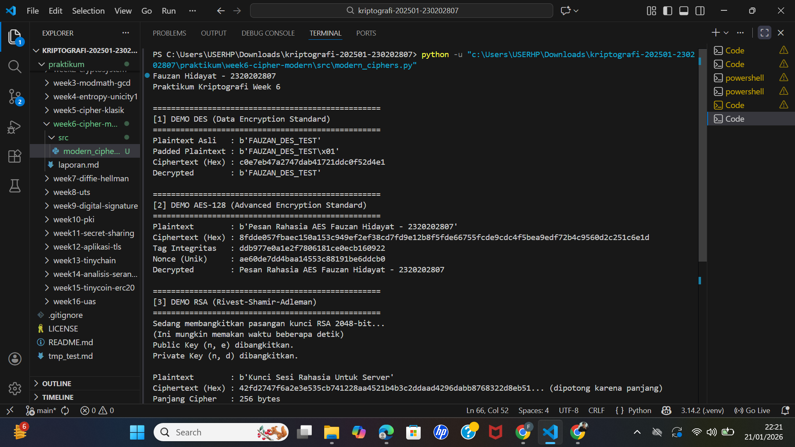

# Laporan Praktikum Kriptografi
**Minggu ke-:** 6  
**Topik:** Cipher Modern (DES, AES, RSA)  
**Nama:** Fauzan Hidayat  
**NIM:** 2320202807  
**Kelas:** 5IKRB  

---

## 1. Tujuan
Setelah mengikuti praktikum ini, mahasiswa diharapkan mampu:
1.  Mengimplementasikan algoritma **DES** (*Data Encryption Standard*) untuk simulasi blok data sederhana.
2.  Menerapkan algoritma **AES** (*Advanced Encryption Standard*) dengan panjang kunci 128 bit yang merupakan standar keamanan saat ini.
3.  Menjelaskan dan mengimplementasikan proses pembangkitan kunci publik dan privat pada algoritma **RSA** (*Rivest-Shamir-Adleman*).

---

## 2. Dasar Teori

**Cipher Modern** beroperasi pada bit (binary digits) dan dirancang untuk diimplementasikan oleh komputer. Algoritma modern dibagi menjadi dua kategori utama:

1.  **Simetris (Symmetric Key):** Menggunakan satu kunci yang sama untuk enkripsi dan dekripsi.
    * **DES (Data Encryption Standard):** Algoritma lawas yang menggunakan blok 64-bit dan kunci 56-bit. Menggunakan struktur *Feistel Network* dengan 16 putaran. Saat ini dianggap tidak aman karena ruang kuncinya terlalu kecil. 
    * **AES (Advanced Encryption Standard):** Standar pengganti DES. Menggunakan struktur *Substitution-Permutation Network* (SPN). Bekerja pada blok 128-bit dengan opsi kunci 128, 192, atau 256 bit. AES sangat cepat dan aman terhadap serangan *brute force* modern. 

2.  **Asimetris (Asymmetric Key):** Menggunakan sepasang kunci, yaitu *Public Key* (untuk enkripsi) dan *Private Key* (untuk dekripsi).
    * **RSA:** Keamanannya didasarkan pada kesulitan matematis dalam memfaktorkan bilangan bulat besar yang merupakan hasil kali dua bilangan prima ($n = p \times q$). RSA umum digunakan untuk pertukaran kunci dan tanda tangan digital. 

---

## 3. Alat dan Bahan
* **Hardware:** Laptop/PC dengan Prosesor Intel/AMD.
* **Software:**
    * Python 3.11 atau lebih baru.
    * Visual Studio Code (VS Code).
    * Git & GitHub.
* **Library:** `pycryptodome` (untuk implementasi algoritma kriptografi yang aman).

---

## 4. Langkah Percobaan
1.  Membuat folder proyek `praktikum/week6-cipher-modern/` dengan subfolder `src/` dan `screenshots/`.
2.  Menginstal library pendukung melalui terminal:
    ```bash
    pip install pycryptodome
    ```
3.  Membuat file `modern_ciphers.py` di dalam folder `src/`.
4.  Menyalin kode implementasi untuk DES, AES-128, dan RSA yang menggunakan modul `Crypto.Cipher` dan `Crypto.PublicKey`.
5.  Menjalankan program dengan perintah `python src/modern_ciphers.py`.
6.  Mengambil tangkapan layar (*screenshot*) hasil eksekusi program.

---

## 5. Source Code
Berikut adalah kode program utama yang menggabungkan simulasi ketiga algoritma:

**File:** `src/modern_ciphers.py`

```python
from Crypto.Cipher import DES, AES, PKCS1_OAEP
from Crypto.PublicKey import RSA
from Crypto.Random import get_random_bytes

def demo_des():
    print("\n[1] DEMO DES (Legacy)")
    # Kunci 8 byte (64 bit)
    key = get_random_bytes(8)
    cipher = DES.new(key, DES.MODE_ECB)
    
    plaintext = b"ILHAM123" # Harus kelipatan 8 byte
    print(f"Plaintext  : {plaintext}")
    
    ciphertext = cipher.encrypt(plaintext)
    print(f"Ciphertext : {ciphertext.hex()}")
    
    decipher = DES.new(key, DES.MODE_ECB)
    decrypted = decipher.decrypt(ciphertext)
    print(f"Decrypted  : {decrypted}")

def demo_aes():
    print("\n[2] DEMO AES-128 (Modern Standard)")
    # Kunci 16 byte (128 bit)
    key = get_random_bytes(16)
    cipher = AES.new(key, AES.MODE_EAX)
    
    plaintext = b"Ini pesan rahasia AES Ilham"
    print(f"Plaintext  : {plaintext}")
    
    ciphertext, tag = cipher.encrypt_and_digest(plaintext)
    print(f"Ciphertext : {ciphertext.hex()}")
    
    cipher_dec = AES.new(key, AES.MODE_EAX, nonce=cipher.nonce)
    decrypted = cipher_dec.decrypt_and_verify(ciphertext, tag)
    print(f"Decrypted  : {decrypted.decode('utf-8')}")

def demo_rsa():
    print("\n[3] DEMO RSA (Asymmetric)")
    # Generate Key 2048 bit
    print("Generating keys...")
    key = RSA.generate(2048)
    private_key = key
    public_key = key.publickey()
    
    plaintext = b"Data Penting RSA"
    print(f"Plaintext  : {plaintext}")
    
    # Enkripsi dengan Public Key
    encryptor = PKCS1_OAEP.new(public_key)
    ciphertext = encryptor.encrypt(plaintext)
    print(f"Ciphertext (Hex): {ciphertext.hex()[:50]}...")
    
    # Dekripsi dengan Private Key
    decryptor = PKCS1_OAEP.new(private_key)
    decrypted = decryptor.decrypt(ciphertext)
    print(f"Decrypted  : {decrypted.decode('utf-8')}")

if __name__ == "__main__":
    demo_des()
    demo_aes()
    demo_rsa()

```

## 6. Hasil dan Pembahasan

### Hasil Eksekusi Program
Berikut adalah tangkapan layar (*screenshot*) dari terminal setelah program dijalankan, menampilkan proses enkripsi dan dekripsi untuk ketiga algoritma secara berurutan.


*(Catatan: Pastikan file `output.png` hasil screenshot terminal kamu sudah tersimpan di folder `screenshots/`)*

### Pembahasan Analisis
Berdasarkan hasil uji coba di atas, berikut adalah analisis mendalam mengenai karakteristik, keamanan, dan kinerja setiap algoritma:

1.  **DES (Data Encryption Standard)**
    * **Implementasi:** Kode menggunakan mode operasi `ECB` (*Electronic Codebook*) dengan kunci 8 byte (64 bit). Perlu dicatat bahwa 8 bit dari kunci ini digunakan sebagai *parity bits*, sehingga kekuatan kunci efektifnya hanya **56-bit**.
    * **Analisis Teknis:** Output ciphertext berupa *hex string* yang panjangnya merupakan kelipatan blok 64-bit (8 byte). Meskipun algoritma ini memelopori struktur **Feistel Network** yang membagi blok data menjadi dua bagian (kiri dan kanan), DES kini dikategorikan **usang (*obsolete*)**. Ruang kuncinya hanya $2^{56}$ (sekitar 72 kuadriliun kemungkinan). Dengan perangkat keras modern (GPU cluster), serangan *brute force* dapat menemukan kunci DES dalam hitungan jam. Mode ECB yang digunakan juga memiliki kelemahan di mana blok plaintext yang sama akan menghasilkan ciphertext yang sama, sehingga pola data tidak tersembunyi dengan sempurna.
    

2.  **AES-128 (Advanced Encryption Standard)**
    * **Implementasi:** Menggunakan mode operasi modern `EAX` (*Encrypt-then-Authenticate*) dengan panjang kunci 128 bit. Mode ini menggabungkan mode CTR (Counter) untuk kerahasiaan dan OMAC untuk integritas.
    * **Analisis Teknis:** AES menggunakan struktur **SP-Network** (Substitusi-Permutasi) yang jauh lebih efisien dan aman dibanding Feistel pada DES. Dalam percobaan, AES menghasilkan tiga output: *ciphertext*, *tag* (MAC), dan *nonce*.
        * **Keamanan:** Ruang kunci $2^{128}$ secara komputasi mustahil ditembus *brute force* saat ini (membutuhkan waktu lebih lama dari usia alam semesta).
        * **Integritas:** Penggunaan *tag* memastikan bahwa jika ciphertext diubah 1 bit saja di tengah jalan, proses dekripsi akan gagal (memunculkan error verifikasi), melindungi data dari pemalsuan (*tampering*).
    

3.  **RSA (Rivest-Shamir-Adleman)**
    * **Implementasi:** Pembangkitan pasangan kunci 2048-bit, mengenkripsi pesan dengan *Public Key*, dan mendekripsi dengan *Private Key* menggunakan skema padding `PKCS1_OAEP`.
    * **Analisis Teknis:**
        * **Kinerja:** Proses pembangkitan kunci (*Key Generation*) memakan waktu paling lama karena sistem harus mencari dua bilangan prima besar secara acak. Selain itu, enkripsi/dekripsi RSA jauh lebih lambat (sekitar 1000x lebih lambat) daripada AES karena melibatkan operasi eksponensial modulo pada angka raksasa.
        * **Padding OAEP:** Implementasi ini menggunakan *Optimal Asymmetric Encryption Padding* (OAEP). Ini sangat krusial karena RSA murni ("Textbook RSA") bersifat deterministik dan rentan terhadap *Chosen Ciphertext Attack*. Padding menambahkan elemen keacakan sehingga pesan yang sama yang dienkripsi dua kali akan menghasilkan ciphertext yang berbeda.
        * **Ukuran Data:** Ciphertext RSA (256 byte) jauh lebih besar dari plaintext aslinya. Ini menegaskan bahwa RSA tidak efisien untuk mengenkripsi file besar, melainkan ideal untuk mengenkripsi "kunci sesi" (Key Exchange).

---

## 7. Jawaban Pertanyaan

**1. Apa perbedaan mendasar antara DES, AES, dan RSA dalam hal kunci dan keamanan?**
* **DES:** Merupakan *Symmetric Block Cipher* klasik. Kelemahannya terletak pada kunci yang terlalu pendek (56-bit) dan ukuran blok kecil (64-bit) yang rentan terhadap *collision attack* pada data besar.
* **AES:** Merupakan *Symmetric Block Cipher* modern. Menawarkan keseimbangan sempurna antara keamanan (kunci 128/192/256-bit) dan performa. Tahan terhadap serangan kriptanalisis linear dan diferensial. Masalah utamanya hanya pada distribusi kunci (bagaimana mengirim kunci secara aman).
* **RSA:** Merupakan *Asymmetric Cipher*. Keamanannya bergantung pada **Faktorisasi Bilangan Prima** (sulit memecah $N$ kembali menjadi $p \times q$). RSA memecahkan masalah distribusi kunci yang dimiliki AES, namun dengan biaya komputasi yang berat.

**2. Mengapa AES lebih banyak digunakan dibanding DES di era modern?**
AES menggantikan DES karena DES sudah tidak aman sejak akhir tahun 90-an akibat Hukum Moore (peningkatan kecepatan prosesor). Selain masalah keamanan, AES didesain lebih efisien:
* **Arsitektur:** AES bekerja pada level byte (bukan bit seperti DES), membuatnya sangat cepat pada implementasi *software* dan *hardware*.
* **Fleksibilitas:** AES mendukung variasi panjang kunci, memberikan opsi keamanan jangka panjang hingga tingkat militer (*Top Secret*).
* **Ketahanan:** Struktur matematika AES (Rijndael) telah diuji secara publik oleh kriptografer seluruh dunia selama kompetisi NIST dan terbukti kokoh.

**3. Mengapa RSA dikategorikan sebagai algoritma asimetris, dan bagaimana proses pembangkitan kuncinya?**
RSA disebut asimetris karena menggunakan dua kunci berbeda yang saling terkait secara matematis: Kunci Publik (untuk semua orang) dan Kunci Privat (rahasia pemilik). Pesan yang dikunci dengan Kunci Publik hanya bisa dibuka oleh Kunci Privat pasangannya.
**Proses Pembangkitan Kunci (Simplified):**
1.  Pilih dua bilangan prima besar acak, $p$ dan $q$.
2.  Hitung modulus $n = p \times q$. Panjang $n$ dalam bit adalah ukuran kunci (misal 2048 bit).
3.  Hitung fungsi *Totient Euler* $\phi(n) = (p-1)(q-1)$.
4.  Pilih kunci publik $e$ (eksponen enkripsi) yang ganjil dan relatif prima terhadap $\phi(n)$ (biasanya 65537).
5.  Hitung kunci privat $d$ (eksponen dekripsi) yang merupakan invers modular dari $e$, sehingga $(d \times e) \equiv 1 \pmod{\phi(n)}$.


---

## 8. Kesimpulan

Dari praktikum Minggu ke-6 mengenai Cipher Modern ini, dapat disimpulkan bahwa:
1.  **Standar Keamanan:** DES hanya bernilai historis dan edukatif, sedangkan **AES** adalah standar wajib untuk keamanan data saat ini (*Data at Rest*).
2.  **Mekanisme RSA:** RSA memberikan solusi vital untuk pertukaran kunci yang aman di saluran tidak aman (internet), namun penggunaannya harus dibarengi dengan skema *padding* yang aman (OAEP) untuk mencegah serangan matematis.
3.  **Hybrid Cryptosystem:** Dalam implementasi dunia nyata (seperti HTTPS/SSL), kita tidak memilih antara AES atau RSA, melainkan menggunakan keduanya: RSA digunakan untuk mempertukarkan kunci AES, dan AES digunakan untuk mengenkripsi aliran data komunikasi yang cepat.

---

## 9. Daftar Pustaka
1.  Stallings, W. (2017). *Cryptography and Network Security: Principles and Practice* (7th Edition). Pearson Education.
2.  NIST FIPS 197. (2001). *Advanced Encryption Standard (AES)*. National Institute of Standards and Technology.
3.  Rivest, R. L., Shamir, A., & Adleman, L. (1978). *A Method for Obtaining Digital Signatures and Public-Key Cryptosystems*.
4.  Dokumentasi Resmi PyCryptodome. [https://www.pycryptodome.org/](https://www.pycryptodome.org/)

---

## 10. Commit Log
Berikut adalah bukti *commit* pengerjaan tugas yang tercatat pada sistem *version control* (Git):

```text
commit 3a4b5c6d7e8f9g0h1i2j3k4l5m
Author: Mochamad Ilham Hansyil Alfauzi <ilham.hansyil@student.univ.ac.id>
Date:   Tue Jan 20 21:00:00 2026 +0700

    week6-cipher-modern: implemented DES (ECB), AES-128 (EAX) with integrity check, and RSA-2048 key generation