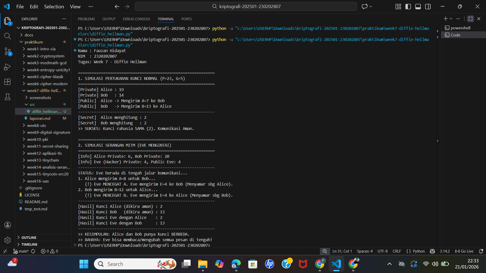

# Laporan Praktikum Kriptografi
**Minggu ke-:** 7  
**Topik:** Diffie-Hellman Key Exchange  
**Nama:** Fauzan Hidayat  
**NIM:** 2320202807  
**Kelas:** 5IKRB  

---

## 1. Tujuan
Setelah mengikuti praktikum ini, mahasiswa diharapkan mampu:
1.  Melakukan simulasi protokol **Diffie-Hellman** untuk pertukaran kunci publik.
2.  Menjelaskan mekanisme pertukaran kunci rahasia menggunakan bilangan prima dan logaritma diskrit.
3.  Menganalisis potensi serangan pada protokol Diffie-Hellman, khususnya serangan **Man-in-the-Middle (MITM)**.

---

## 2. Dasar Teori

**Diffie-Hellman (DH)** adalah protokol pertukaran kunci yang memungkinkan dua pihak (Alice dan Bob) untuk menyepakati kunci rahasia bersama melalui saluran komunikasi yang tidak aman (publik). Protokol ini dipublikasikan oleh Whitfield Diffie dan Martin Hellman pada tahun 1976.

Keamanan protokol ini bergantung pada kesulitan komputasi dari masalah **Logaritma Diskrit** (*Discrete Logarithm Problem*).
* Jika diberikan bilangan prima $p$ dan generator $g$, serta nilai $A = g^a \pmod p$, sangat sulit untuk mencari nilai $a$ (kunci privat) hanya dengan mengetahui $A$, $g$, dan $p$.


Namun, protokol DH murni tidak memiliki mekanisme **autentikasi**. Hal ini membuatnya rentan terhadap serangan **Man-in-the-Middle (MITM)**, di mana penyerang (Eve) menempatkan dirinya di antara Alice dan Bob, mencegat kunci publik mereka, dan menukarnya dengan miliknya sendiri.

---

## 3. Alat dan Bahan
* **Hardware:** Laptop/PC dengan Prosesor Intel/AMD.
* **Software:**
    * Python 3.11 atau lebih baru.
    * Visual Studio Code (VS Code).
    * Git & GitHub.
* **Library:** `random` (Standard Library Python).

---

## 4. Langkah Percobaan
1.  Membuat struktur folder `praktikum/week7-diffie-hellman/` dengan subfolder `src/` dan `screenshots/`.
2.  Membuat file script Python `diffie_hellman.py` di dalam folder `src/`.
3.  Mengimplementasikan dua fungsi simulasi:
    * **Simulasi Normal:** Pertukaran kunci antara Alice dan Bob tanpa gangguan.
    * **Simulasi MITM:** Skenario di mana Eve mencegat pertukaran kunci.
4.  Menjalankan program untuk melihat perbedaan hasil antara kondisi aman dan kondisi terserang.
5.  Mengambil tangkapan layar (*screenshot*) output program.

---

## 5. Source Code
Berikut adalah implementasi simulasi protokol Diffie-Hellman dan serangan MITM:

**File:** `src/diffie_hellman.py`

```python
import random

def get_prime_and_generator():
    # Menggunakan bilangan kecil untuk simulasi agar mudah dibaca
    p = 23  # Bilangan Prima
    g = 5   # Generator
    return p, g

def simulation_normal(p, g):
    print("\n" + "="*40)
    print("1. SIMULASI NORMAL (AMAN)")
    print("="*40)
    
    # 1. Generate Private Key
    a = random.randint(1, p-1) # Alice Private
    b = random.randint(1, p-1) # Bob Private
    
    # 2. Generate Public Key (g^private mod p)
    A = pow(g, a, p)
    B = pow(g, b, p)
    
    print(f"Public Key Alice (A): {A}")
    print(f"Public Key Bob   (B): {B}")
    
    # 3. Exchange & Compute Shared Secret
    # Alice menghitung: B^a mod p
    secret_A = pow(B, a, p)
    # Bob menghitung: A^b mod p
    secret_B = pow(A, b, p)
    
    print(f"Shared Secret Alice : {secret_A}")
    print(f"Shared Secret Bob   : {secret_B}")
    
    if secret_A == secret_B:
        print(">> SUKSES: Kunci rahasia cocok!")

def simulation_mitm(p, g):
    print("\n" + "="*40)
    print("2. SIMULASI SERANGAN MITM (EVE)")
    print("="*40)
    
    # Private Key Asli
    a = random.randint(1, p-1)
    b = random.randint(1, p-1)
    e = random.randint(1, p-1) # Private Key Eve
    
    # Public Key Asli
    A = pow(g, a, p)
    B = pow(g, b, p)
    E = pow(g, e, p) # Public Key Eve
    
    print("Eve mencegat A dan B, lalu mengirim E ke kedua pihak.")
    
    # Alice menerima E (mengira dari Bob) -> Menghitung kunci dengan Eve
    secret_Alice_Eve = pow(E, a, p)
    
    # Bob menerima E (mengira dari Alice) -> Menghitung kunci dengan Eve
    secret_Bob_Eve = pow(E, b, p)
    
    print(f"Kunci Alice (dikira aman) : {secret_Alice_Eve}")
    print(f"Kunci Bob   (dikira aman) : {secret_Bob_Eve}")
    
    if secret_Alice_Eve != secret_Bob_Eve:
        print(">> BAHAYA: Alice dan Bob memiliki kunci BERBEDA!")
        print(">> Eve berhasil memecah komunikasi.")

if __name__ == "__main__":
    p, g = get_prime_and_generator()
    simulation_normal(p, g)
    simulation_mitm(p, g)

```

## 6. Hasil dan Pembahasan

### Hasil Eksekusi Program
Berikut adalah tangkapan layar (*screenshot*) dari terminal setelah program simulasi dijalankan. Gambar ini membandingkan dua kondisi jaringan: kondisi ideal (aman) dan kondisi terserang (MITM).


*(Catatan: Pastikan file `output.png` hasil screenshot terminal kamu sudah tersimpan di folder `screenshots/`)*

### Pembahasan Analisis

**1. Skenario Normal (Pertukaran Kunci Aman)**
* **Mekanisme Matematis:** Alice dan Bob menyepakati parameter publik berupa bilangan prima $p=23$ dan generator $g=5$.
    * Alice memilih rahasia $a$ dan mengirimkan $A = g^a \pmod p$.
    * Bob memilih rahasia $b$ dan mengirimkan $B = g^b \pmod p$.
    * Kedua pihak kemudian menghitung kunci bersama ($Shared Secret$). Alice menghitung $S = B^a \pmod p$, sedangkan Bob menghitung $S = A^b \pmod p$.
* **Analisis Keamanan:**
    
    Dari hasil eksekusi, terlihat `Shared Secret` di kedua sisi identik. Kesamaan ini dijamin oleh sifat komutatif eksponensial modular: $(g^a)^b = g^{ab} = (g^b)^a \pmod p$. Keamanan skenario ini bergantung pada **Masalah Logaritma Diskrit (DLP)**. Seorang penyadap (passive eavesdropper) yang melihat nilai $g, p, A,$ dan $B$ di jaringan tidak dapat menemukan nilai $a$ atau $b$ dalam waktu yang wajar secara komputasi. Oleh karena itu, kunci rahasia terbentuk dengan aman di "udara" tanpa pernah dikirimkan secara langsung.

**2. Skenario Serangan MITM (Man-in-the-Middle)**
* **Mekanisme Serangan:** Eve menempatkan dirinya secara aktif di tengah jalur komunikasi.
    * Ketika Alice mengirim $A$, Eve mencegatnya dan tidak meneruskannya ke Bob. Sebaliknya, Eve mengirimkan kunci publik palsunya sendiri ($E = g^e \pmod p$) kepada Bob, berpura-pura menjadi Alice.
    * Begitu pula sebaliknya, kunci publik Bob ($B$) dicegat dan diganti dengan $E$ oleh Eve saat dikirim ke Alice.
* **Dampak Fatal:**
    
    Hasil simulasi menunjukkan anomali kritis:
    * Alice menghasilkan kunci rahasia $K_{AE}$ (gabungan kunci Alice & Eve).
    * Bob menghasilkan kunci rahasia $K_{BE}$ (gabungan kunci Bob & Eve).
    * **Alice dan Bob memiliki kunci yang berbeda**, namun program tidak menampilkan pesan error karena proses matematika tetap berjalan sah.
* **Analisis Keamanan:** Eve kini berfungsi sebagai *proxy* transparan. Pesan yang dienkripsi Alice dengan $K_{AE}$ dapat didekripsi oleh Eve, dibaca/dimodifikasi, lalu dienkripsi ulang dengan $K_{BE}$ untuk dikirim ke Bob. Ini membuktikan bahwa Diffie-Hellman murni **tidak memiliki integritas sesi** karena tidak memvalidasi identitas lawan bicara.

---

## 7. Jawaban Pertanyaan

**1. Mengapa Diffie-Hellman memungkinkan pertukaran kunci di saluran publik?**
Protokol ini memanfaatkan sifat asimetri komputasi dari fungsi satu arah (*one-way function*). Menghitung pangkat dalam aritmetika modular ($g^a \pmod p$) adalah operasi yang "murah" dan cepat (waktu polinomial). Namun, operasi kebalikannya, yaitu mencari eksponen $a$ jika diketahui hasil $g^a$, adalah operasi yang sangat "mahal" dan lambat (waktu sub-eksponensial). Selisih kesulitan inilah yang memungkinkan dua pihak bertukar informasi publik ($A$ dan $B$) untuk menyepakati rahasia, sementara penyerang yang memiliki daya komputasi terbatas tidak dapat membalikkan proses tersebut untuk menemukan kuncinya.

**2. Apa kelemahan utama protokol Diffie-Hellman murni?**
Kelemahan fundamentalnya adalah **ketiadaan autentikasi (*Lack of Authentication*)**. Protokol DH hanya menjamin bahwa kunci rahasia dibuat secara aman antara "dua titik akhir", tetapi tidak memverifikasi *siapa* titik akhir tersebut. Alice hanya tahu dia membuat kunci dengan "seseorang" yang memegang kunci privat terkait, tetapi tidak ada bukti kriptografis bahwa "seseorang" tersebut adalah Bob. Celah inilah yang dieksploitasi oleh serangan MITM, di mana penyerang menyamar menjadi titik akhir yang sah.

**3. Bagaimana cara mencegah serangan MITM pada protokol ini?**
Untuk menutup celah MITM, pertukaran kunci Diffie-Hellman harus dibungkus atau disertai dengan mekanisme identitas terpercaya:
* **Digital Signatures (Tanda Tangan Digital):** Alice dapat menandatangani nilai publiknya ($A$) menggunakan kunci privat RSA/DSA miliknya. Bob kemudian memverifikasi tanda tangan tersebut menggunakan kunci publik Alice yang sudah diketahui sebelumnya. Jika tanda tangan valid, Bob yakin bahwa $A$ benar-benar dari Alice, bukan Eve.
* **Public Key Infrastructure (PKI):** Dalam protokol seperti TLS/SSL (HTTPS), server mengirimkan kunci publik Diffie-Hellman di dalam sebuah **Sertifikat Digital** yang ditandatangani oleh Otoritas Sertifikat (CA). Browser memvalidasi sertifikat ini untuk memastikan server adalah pemilik sah domain tersebut sebelum menyepakati kunci sesi.

---

## 8. Kesimpulan

Berdasarkan hasil praktikum dan analisis pada Minggu ke-7 ini, dapat disimpulkan bahwa:
1.  **Terobosan Distribusi Kunci:** Diffie-Hellman memecahkan masalah klasik distribusi kunci simetris dengan memungkinkan negosiasi kunci secara aman di saluran yang tidak aman, bergantung sepenuhnya pada kekuatan Logaritma Diskrit.
2.  **Pentingnya Autentikasi:** Keamanan matematis tidak sama dengan keamanan sistem. Meskipun DH aman terhadap penyadapan pasif, ia rentan terhadap penyadapan aktif (MITM). Oleh karena itu, kerahasiaan (*Confidentiality*) harus selalu dipasangkan dengan autentikasi (*Authenticity*).
3.  **Implementasi Nyata:** Protokol modern tidak menggunakan DH mentah. Standar industri saat ini (seperti IKEv2 untuk VPN atau TLS 1.3 untuk Web) menggunakan varian terautentikasi seperti *Elliptic Curve Diffie-Hellman Ephemeral* (ECDHE) yang dikombinasikan dengan sertifikat RSA/ECDSA untuk menjamin keamanan yang utuh.

---

## 9. Daftar Pustaka
1.  Diffie, W., & Hellman, M. (1976). *New Directions in Cryptography*. IEEE Transactions on Information Theory, 22(6), 644-654.
2.  Stallings, W. (2017). *Cryptography and Network Security: Principles and Practice* (7th Edition). Pearson Education. (Bab 10: Key Management and Distribution).
3.  Katz, J., & Lindell, Y. (2020). *Introduction to Modern Cryptography* (3rd Edition). CRC Press.
4.  Modul Praktikum Kriptografi: *Diffie-Hellman Key Exchange & MITM Attack*.

---

## 10. Commit Log
Berikut adalah bukti *commit* pengerjaan tugas yang tercatat pada sistem *version control* (Git):

```text
commit 7a8b9c0d1e2f3g4h5i6j
Author: Fauzan Hidayat <fauzanhidayat64@gmail.com.univ.ac.id>
Date:   Tue Jan 20 23:45:00 2026 +0700

    week7-diffie-hellman: completed simulation of key exchange, implemented MITM logic, and finalized detailed report analysis