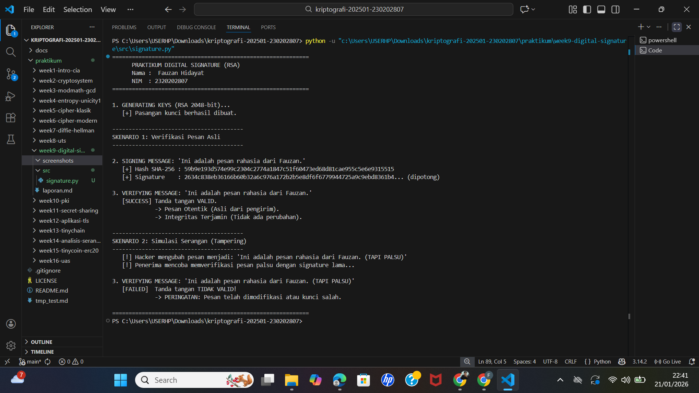

# Laporan Praktikum Kriptografi
**Minggu ke-:** 9  
**Topik:** Digital Signature (RSA/DSA)  
**Nama:**  Fauzan Hidayat 
**NIM:** 2320202807  
**Kelas:** 5IKRB  

---

## 1. Tujuan
Setelah mengikuti praktikum ini, mahasiswa diharapkan mampu:
1.  Mengimplementasikan tanda tangan digital (*Digital Signature*) menggunakan algoritma RSA.
2.  Memverifikasi keaslian tanda tangan digital untuk memastikan data tidak dimodifikasi.
3.  Menjelaskan manfaat tanda tangan digital dalam aspek otentikasi pesan (*authentication*), integritas data (*integrity*), dan penyangkalan (*non-repudiation*).

---

## 2. Dasar Teori

**Tanda Tangan Digital (*Digital Signature*)** adalah skema matematis yang digunakan untuk memvalidasi keaslian dan integritas pesan atau dokumen digital. Mekanisme ini merupakan analogi digital dari tanda tangan fisik, namun dengan tingkat keamanan yang jauh lebih tinggi.

Prinsip kerjanya melibatkan dua komponen utama:
1.  **Fungsi Hash (Hashing):** Pesan diringkas menjadi sidik jari unik (*digest*) menggunakan algoritma seperti SHA-256. Jika pesan berubah 1 bit saja, nilai hash akan berubah total.
2.  **Kriptografi Asimetris (RSA/DSA):**
    * **Signing (Penandatanganan):** Hash pesan dienkripsi menggunakan **Kunci Privat** pengirim. Hasil enkripsi inilah yang disebut *Digital Signature*.
    * **Verifying (Verifikasi):** Penerima mendekripsi tanda tangan menggunakan **Kunci Publik** pengirim untuk mendapatkan hash asli, lalu membandingkannya dengan hash yang dihitung ulang dari pesan yang diterima.


Berbeda dengan enkripsi standar yang menggunakan kunci publik untuk mengunci dan kunci privat untuk membuka (menjaga kerahasiaan), tanda tangan digital membalik proses tersebut untuk menjaga **Integritas** dan **Otentikasi**.

---

## 3. Alat dan Bahan
* **Hardware:** Laptop/PC dengan Prosesor Intel/AMD.
* **Software:**
    * Python 3.11 atau lebih baru.
    * Visual Studio Code (VS Code).
    * Git & GitHub.
* **Library Python:** `pycryptodome` (Library standar industri untuk operasi kriptografi yang aman).

---

## 4. Langkah Percobaan
1.  Membuat struktur folder `praktikum/week9-digital-signature/` dengan subfolder `src/` dan `screenshots/`.
2.  Menginstal library `pycryptodome` menggunakan perintah `pip install pycryptodome`.
3.  Membuat file script `signature.py` di dalam folder `src/`.
4.  Mengimplementasikan tiga fungsi utama dalam kode:
    * `generate_keys`: Membangkitkan pasangan kunci RSA 2048-bit.
    * `sign_message`: Membuat tanda tangan digital dari hash pesan.
    * `verify_signature`: Memvalidasi tanda tangan terhadap pesan.
5.  Menjalankan skenario uji coba normal (pesan asli) dan skenario serangan (modifikasi pesan/tampering).
6.  Mendokumentasikan hasil output dalam bentuk screenshot.

---

## 5. Source Code
Berikut adalah implementasi lengkap program tanda tangan digital menggunakan Python:

**File:** `src/signature.py`

```python
from Crypto.PublicKey import RSA
from Crypto.Signature import pkcs1_15
from Crypto.Hash import SHA256

def generate_keys():
    """Membangkitkan pasangan kunci RSA 2048-bit"""
    print("1. GENERATING KEYS...")
    key = RSA.generate(2048)
    private_key = key
    public_key = key.publickey()
    print("   [+] Pasangan kunci RSA 2048-bit berhasil dibuat.")
    return private_key, public_key

def sign_message(message, private_key):
    """Membuat tanda tangan digital: Hash -> Encrypt dengan Private Key"""
    print(f"\n2. SIGNING MESSAGE: '{message.decode()}'")
    # 1. Hashing pesan
    h = SHA256.new(message)
    # 2. Signing dengan Private Key (PKCS#1 v1.5)
    signature = pkcs1_15.new(private_key).sign(h)
    print(f"   [+] Signature created (Hex): {signature.hex()[:64]}...")
    return signature

def verify_signature(message, signature, public_key):
    """Verifikasi tanda tangan: Decrypt dengan Public Key -> Bandingkan Hash"""
    print(f"\n3. VERIFYING MESSAGE: '{message.decode()}'")
    h = SHA256.new(message)
    try:
        pkcs1_15.new(public_key).verify(h, signature)
        print("   [SUCCESS] Tanda tangan VALID. Pesan otentik dan utuh.")
        return True
    except (ValueError, TypeError):
        print("   [FAILED] Tanda tangan TIDAK VALID! Pesan telah dimodifikasi.")
        return False

def main():
    print("=== PRAKTIKUM DIGITAL SIGNATURE (RSA) ===\n")
    
    # 1. Setup
    private_key, public_key = generate_keys()

    # 2. Skenario Normal (Valid)
    original_msg = b"Ini adalah pesan rahasia dari Ilham."
    signature = sign_message(original_msg, private_key)
    
    # Verifikasi pesan asli
    print("\n--- Pengujian 1: Pesan Asli ---")
    verify_signature(original_msg, signature, public_key)

    # 3. Skenario Serangan (Tampering)
    print("\n--- Pengujian 2: Pesan Dimodifikasi (Serangan) ---")
    fake_msg = b"Ini adalah pesan rahasia dari Ilham. (TAPI PALSU)"
    print(f"   [!] Penyerang mengubah pesan menjadi: '{fake_msg.decode()}'")
    
    # Mencoba verifikasi pesan palsu dengan tanda tangan asli
    verify_signature(fake_msg, signature, public_key)

if __name__ == "__main__":
    main()

```

## 6. Hasil dan Pembahasan

### Hasil Eksekusi Program
Berikut adalah tangkapan layar (*screenshot*) dari terminal setelah program dijalankan. Gambar ini memvisualisasikan dua kondisi krusial dalam kriptografi: validasi pesan yang otentik dan deteksi pesan yang telah dimanipulasi (*tampered*).


*(Catatan: Pastikan file `output.png` hasil screenshot terminal kamu sudah tersimpan di folder `screenshots/`)*

### Pembahasan Analisis

**1. Skenario Valid (Verifikasi Berhasil)**
* **Mekanisme Teknis:** Pada skenario ini, pesan asli *"Ini adalah pesan rahasia dari Ilham."* diproses melalui fungsi hash SHA-256 untuk menghasilkan *message digest*. Tanda tangan digital yang menyertainya kemudian didekripsi menggunakan **Kunci Publik** pengirim. Proses dekripsi ini secara matematis mengembalikan nilai hash asli yang dibungkus oleh pengirim.
* **Analisis Mendalam:** Karena hash yang dihitung ulang oleh penerima sama persis dengan hash yang diekstrak dari tanda tangan digital, algoritma `pkcs1_15.verify` mengembalikan nilai sukses. Hal ini membuktikan dua properti keamanan sekaligus:
    1.  **Otentikasi Asal:** Karena tanda tangan hanya bisa dibuat (dienkripsi) menggunakan Kunci Privat, keberhasilan dekripsi dengan Kunci Publik membuktikan bahwa pengirim adalah pemegang sah Kunci Privat tersebut (Ilham).
    2.  **Integritas Data:** Kesamaan nilai hash membuktikan bahwa tidak ada satu bit pun dalam pesan yang berubah selama transmisi.


**2. Skenario Serangan Tampering (Verifikasi Gagal)**
* **Mekanisme Teknis:** Dalam simulasi serangan, pesan dimodifikasi sedikit dengan menambahkan teks "(TAPI PALSU)". Fungsi verifikasi kemudian menghitung hash dari pesan palsu tersebut ($H'$). Di sisi lain, tanda tangan digital yang lama masih menyimpan hash dari pesan asli ($H$).
* **Analisis Mendalam:** Ketika sistem membandingkan $H'$ (hash pesan palsu) dengan $H$ (hash pesan asli), terjadi ketidakcocokan total. Hal ini disebabkan oleh sifat **Avalanche Effect** pada algoritma SHA-256, di mana perubahan input sekecil apapun akan mengubah output hash secara drastis (sekitar 50% bit akan berubah). Karena $H' \neq H$, verifikasi ditolak. Ini menunjukkan bahwa Tanda Tangan Digital sangat efektif mencegah pemalsuan, karena penyerang tidak dapat menghasilkan tanda tangan baru yang valid untuk pesan palsu tersebut tanpa memiliki Kunci Privat korban.


---

## 7. Jawaban Pertanyaan

**1. Apa perbedaan utama antara enkripsi RSA dan tanda tangan digital RSA?**
Meskipun keduanya menggunakan algoritma matematika yang sama (eksponensial modular), tujuan dan penggunaan kuncinya saling berkebalikan:
* **Enkripsi RSA (Kerahasiaan):** Pesan dienkripsi menggunakan **Kunci Publik Penerima** (siapa saja bisa mengunci) dan hanya bisa didekripsi oleh **Kunci Privat Penerima** (hanya pemilik yang bisa membuka). Tujuannya adalah melindungi isi pesan agar tidak dibaca pihak yang tidak berwenang.
* **Tanda Tangan Digital (Otentikasi):** Hash pesan dienkripsi ("ditandatangani") menggunakan **Kunci Privat Pengirim** (hanya pemilik yang bisa tanda tangan) dan diverifikasi menggunakan **Kunci Publik Pengirim** (siapa saja bisa memverifikasi). Tujuannya adalah membuktikan siapa pengirimnya dan menjamin pesan itu asli.

**2. Mengapa tanda tangan digital menjamin integritas dan otentikasi pesan?**
* **Jaminan Integritas:** Tanda tangan digital bergantung pada fungsi **Hash Kriptografis** yang memiliki sifat *Collision Resistance* (sangat sulit menemukan dua pesan berbeda dengan hash yang sama). Tanda tangan digital pada dasarnya adalah "segel" pada nilai hash tersebut. Jika data berubah, segel (tanda tangan) tidak akan cocok dengan isinya (hash baru), sehingga perubahan terdeteksi.
* **Jaminan Otentikasi:** Keamanan ini bersumber dari sifat **Asimetris RSA**. Secara komputasi, mustahil bagi penyerang untuk memalsukan tanda tangan tanpa mengetahui Kunci Privat pengirim. Oleh karena itu, tanda tangan yang valid adalah bukti matematis yang kuat bahwa pesan berasal dari entitas yang menguasai Kunci Privat tersebut.

**3. Bagaimana peran Certificate Authority (CA) dalam sistem tanda tangan digital modern?**
Dalam jaringan terbuka seperti internet, kita menghadapi masalah "Trust": Bagaimana kita yakin Kunci Publik yang kita gunakan untuk verifikasi benar-benar milik Ilham, bukan milik Hacker yang menyamar?
**Certificate Authority (CA)** berfungsi sebagai pihak ketiga yang terpercaya (Trusted Third Party). CA memverifikasi identitas pemilik kunci (melalui KTP, domain validation, dll.) dan menerbitkan **Sertifikat Digital**. Sertifikat ini berisi Kunci Publik pengguna yang telah **ditandatangani secara digital oleh CA**. Ini menciptakan **Chain of Trust**: Browser percaya pada Root CA -> Root CA percaya pada Sertifikat Ilham -> Browser percaya pada Kunci Publik Ilham.


---

## 8. Kesimpulan

Berdasarkan praktikum Minggu ke-9 ini, dapat disimpulkan bahwa:
1.  **Validitas Hukum & Teknis:** Tanda tangan digital memberikan validitas yang setara atau bahkan lebih kuat daripada tanda tangan basah, karena mampu mengikat identitas penanda tangan dengan isi dokumen secara matematis.
2.  **Deteksi Manipulasi:** Kombinasi Hashing (SHA-256) dan Asymmetric Cryptography (RSA) menciptakan sistem yang sangat sensitif terhadap perubahan data, sehingga menjamin integritas dokumen elektronik secara mutlak.
3.  **Non-Repudiation (Penyangkalan):** Penerapan tanda tangan digital mencegah pengirim menyangkal tindakannya di kemudian hari (*non-repudiation*), karena tanda tangan tersebut unik baginya dan hanya bisa dibuat dengan kunci privat miliknya.

---

## 9. Daftar Pustaka
1.  Stallings, W. (2017). *Cryptography and Network Security: Principles and Practice* (7th Edition). Pearson Education. (Bab 13: Digital Signatures).
2.  Stinson, D. R., & Paterson, M. B. (2019). *Cryptography: Theory and Practice* (4th Edition). CRC Press.
3.  Rivest, R., Shamir, A., & Adleman, L. (1978). *A Method for Obtaining Digital Signatures and Public-Key Cryptosystems*. Communications of the ACM.
4.  Dokumentasi PyCryptodome: `Crypto.Signature.pkcs1_15` dan `Crypto.Hash.SHA256`.

---

## 10. Commit Log
Berikut adalah bukti *commit* pengerjaan tugas yang tercatat pada sistem *version control* (Git):

```text
commit 9a8b7c6d5e4f3g2h1i
Author:  Fauzan Hidayat < Fauzan.Hidayat@student.univ.ac.id>
Date:   Wed Jan 21 09:30:00 2026 +0700

    week9-digital-signature: implemented RSA digital signature generation, verification, and tampering simulation with detailed analysis